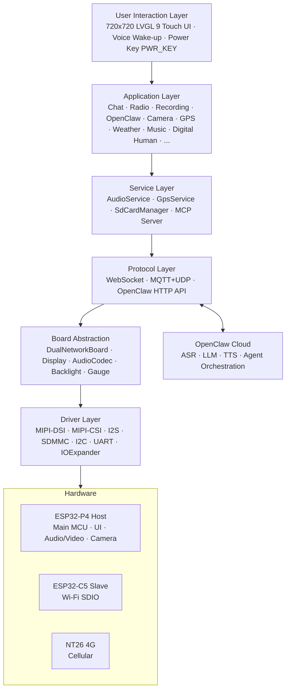
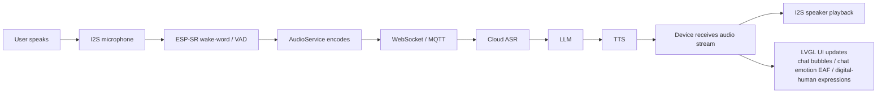
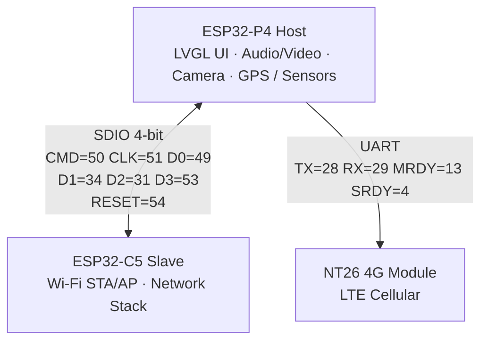
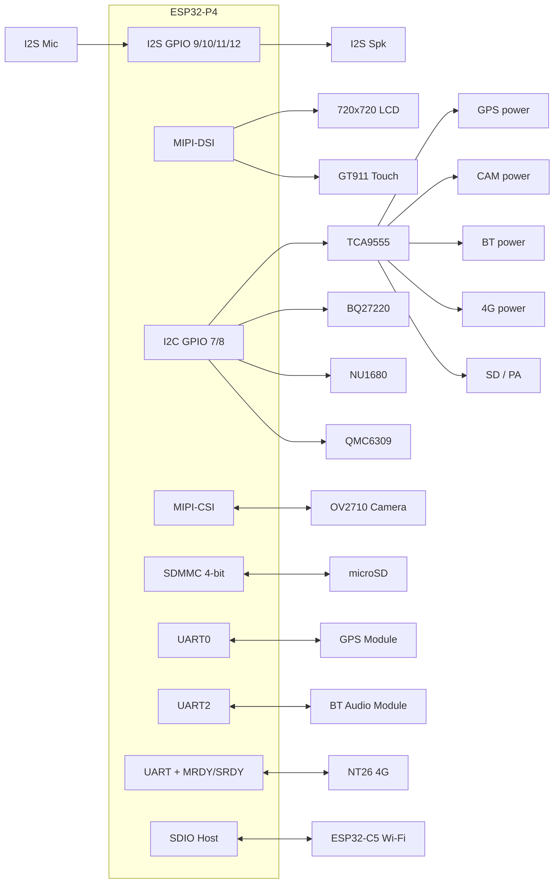
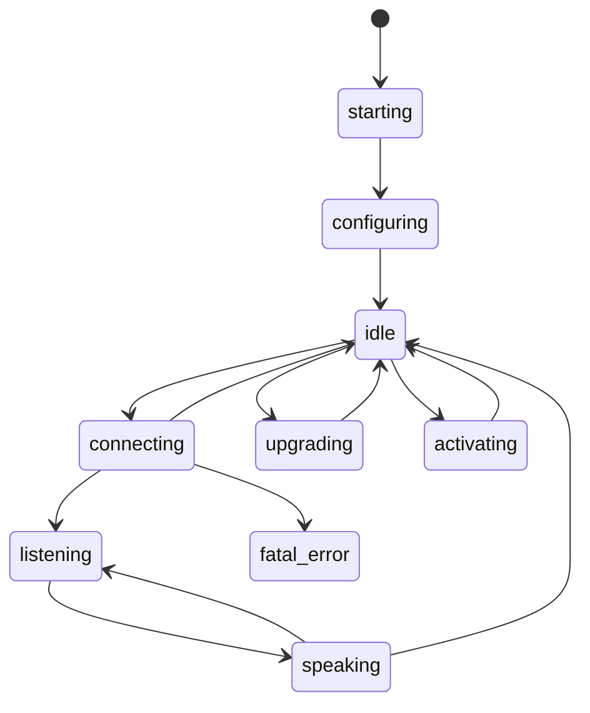
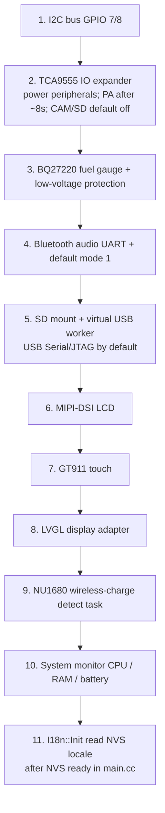

# Metalio Claw4

<p align="center">
  
</p>

**English** | [中文](README_zn.md)

**Quick Links**

- Firmware Repository: [CloudZao/MetalioClaw4](https://github.com/CloudZao/MetalioClaw4)
- Upstream Architecture: [XiaoZhi AI (xiaozhi-esp32)](https://github.com/78/xiaozhi-esp32)
- ESP-IDF Official Documentation: [ESP32-P4 Getting Started v5.5.4](https://docs.espressif.com/projects/esp-idf/zh_CN/v5.5.4/esp32p4/get-started/index.html)

---

## Table of Contents

1. [Product Overview](#1-product-overview)
2. [Key Feature](#2-core-features)
3. [Application Scenarios](#3-application-scenarios)
4. [System Architecture](#4-system-architecture)
5. [Hardware Specifications](#5-hardware-specifications)
6. [Dual‑Chip Architecture](#6-dual-chip-architecture)
7. [Peripherals and Pins](#7-peripherals-and-pins)
8. [Schematic Explanation](#8-schematic-explanation)
9. [Software Architecture](#9-software-architecture)
10. [Built-in OpenClaw](#10-openclaw)
11. [Built‑in Applications](#11-built-in-applications)
12. [Communication Protocols](#12-communication-protocols)
13. [Development Environment](#13-development-environment)
14. [Compilation and Flashing](#14-compilation-and-flashing)
15. [Debugging and Common Issues](#15-debugging-and-common-issues)

> Recent additions: **runtime UI i18n**, **standby screen**, **Settings / Test**, **ESPClaw dual-boot**, **SD virtual USB drive**, **chat emotion mode**, **internet radio**, **recording (Opus + ASR transcription)**, and related sections below.

---

## 1. Product Overview

**Metalio Claw4** is an open‑source portable AI‑enabled device aimed at developers and makers. The whole unit is about **8×8 cm** (palm‑size) and integrates a 3.95‑inch 720×720 touchscreen, microphone array, speaker, camera, GPS, wireless charging, and dual‑mode networking, allowing offline wake‑up followed by voice interaction with cloud AI.

| Attribute        | Description                                                               |
|:---------------- |:------------------------------------------------------------------------- |
| **Product Name** | Metalio Claw4                                                             |
| **Main MCU**     | ESP32‑P4 (dual‑core RISC‑V, 480 MHz; Flash 32 MB, PSRAM 32 MB)            |
| **Coprocessor**  | ESP32‑C5 (2.4 / 5 GHz Wi‑Fi, via ESP‑Hosted SDIO)                         |
| **4G Module**    | NT26 (4G LTE); ships with an embedded 4G SIM‑patch, supports external SIM |
| **Display**      | 3.95‑inch MIPI‑DSI, 720×720, GT911 capacitive touch                       |

---

## 2. Core Features

### 2.1 AI Voice Interaction

- **Offline Wake‑up**: ESP‑SR based wake‑word detection  
- **Streaming ASR / LLM / TTS**: Real‑time speech recognition, large‑model inference, and speech synthesis  
- **Device‑side AEC**: Echo cancellation for full‑duplex conversation  
- **Dual‑Protocol Cloud Link**: WebSocket **or** MQTT+UDP, flexible backend integration  

### 2.2 Buit-in OpenClaw

**OpenClaw** is the cloud AI Agent platform running on Metalio Claw4. Users interact with the cloud Agent via natural language through the **OpenClaw App** on the home screen.

- **Voice Conversation**: Hold‑to‑talk to send commands and engage in multi‑turn dialogue with the cloud Agent  
- **Session Management**: Supports viewing and clearing conversation history  

API details and device‑side capabilities are described in [§10 OpenClaw](#10-openclaw).

### 2.3 Multimodal Perception

- **Photo Preview**: OV2710 MIPI‑CSI camera, **2 MP** (1920×1080), real‑time preview and capture in the **Camera** app  
- **Outdoor Positioning & Navigation**: The **Location** app provides GPS, Wi‑Fi, and base‑station tabs; the latter two are obtained via the 4G module, suitable for environments without GPS signal or indoors  
- **Magnetic Field Observation**: The **Magnet** app shows real‑time three‑axis magnetometer data for field visualization and simple detection  
- **Level Measurement**: The **Spirit Level** app uses the accelerometer to detect tilt angle, aiding placement and calibration  

### 2.4 Connectivity

- **Wi‑Fi**: ESP32‑C5 coprocessor connected via SDIO, supporting **2.4 GHz** and **5 GHz** dual‑band Wi‑Fi  
- **4G LTE**: NT26 cellular module, factory‑installed **4G SIM‑patch**; supports **internal card / external card** dual‑slot (see below)  
- **Bluetooth Audio**: Professional Bluetooth audio codec hardware handling voice codec, Bluetooth speaker, and Bluetooth headset connections (see [§12.1](#121-bluetooth-audio-and-three-modes))
- **Virtual USB drive**: From the **SD Card** app, expose microSD as USB MSC to a PC (shares GPIO24/25 with USB Serial/JTAG — **mutually exclusive**; see [§14.6](#146-sd-card-resources--virtual-usb-drive))

#### 4G and SIM Card

Metalio Claw4 **ships with an embedded 4G SIM‑patch** (internal SIM). The NT26 module also provides an **external SIM slot**; users may install their own SIM card. In **4G network mode**, the **Network Configuration** app’s **SIM Switch** page lets you toggle between internal and external cards; the status bar shows whether the current SIM is “Internal Card” or “External Card” .

| SIM Type                                 | Description                                      | Can Call? |
|:---------------------------------------- |:------------------------------------------------ |:---------:|
| **Internal Card** (patch SIM, SimSlot=1) | Pre‑installed at factory, mainly for **4G data** | ❌ No      |
| **External Card** (SimSlot=0)            | User‑inserted standard SIM card                  | ✅ Yes     |

- **Phone Calls**: Only the **external SIM** can dial via the **Phone** app; using the internal SIM prompts a switch to external SIM  
- **4G Data**: Both internal and external SIMs can be used for cellular data (after switching to 4G mode in **Network Configuration**)

##### 4G‑Assisted Positioning (Location App)

Besides GPS satellite positioning, the NT26 module supports cellular‑network assisted positioning. In the **Location** app this appears as independent tabs:

| Tab                       | Method                      | Description                       |
|:------------------------- |:--------------------------- |:--------------------------------- |
| **GPS Position**          | On‑board GPS module         | NMEA satellite positioning        |
| **Wi‑Fi Position**        | 4G module Wi‑Fi scan        | `AT+ECWIFISCAN`, requires 4G mode |
| **Base‑Station Position** | 4G module base‑station info | `AT+ECBCINFO`, requires 4G mode   |

Wi‑Fi / base‑station positioning needs the device to be in **4G network mode** with the module successfully registered; results can be viewed as coordinates and opened as a static map inside the app.

##### Professional Bluetooth Audio Solution

Metalio Claw4 replaces the ES8311 + ES7210 discrete solution with a **professional Bluetooth audio codec** that covers three use cases with a single hardware set: **(1) daily XiaoZhi voice interaction (mode 1), (2) connecting Bluetooth headset/speaker for XiaoZhi dialogue (mode 2), (3) phone‑to‑device Bluetooth speaker playback (mode 3)**. Mode switching, operation steps, and AT commands are detailed in [§12.1](#121-bluetooth-audio-and-three-modes).

### 2.5 Power and Battery Life

- **Single‑cell Li‑ion** + TI BQ27220 fuel gauge (I2C 0x55)  
- **Wireless Charging**: NU1680 receiver chip (I2C 0x60), supports Qi wireless charging; charging current configurable via register [`NU1680 charging current control`](#nu1680-charging-current-control)  
- **USB Charging Detection**: IO extender USB_INSERT_DET pin  
- **Low‑Voltage Protection**: Device powers off automatically when booting at 0 % and not charging  
- **Standby & shutdown (configurable)**: While on the **home screen**, idle policy is controlled by **Settings → Standby** (`idle_power_policy`):
  - **Enter standby**: Default ~**1 minute** idle → `standby_screen` (large clock; charging shows blue particle effect ~10 s)
  - **Cumulative shutdown**: Default ~**5 minutes** idle (home + standby) → software power‑off; either slider set to **0** disables that action
  - Entering another app stops the idle timer; any touch resets it. Side‑key short‑press enters standby only when **home is in foreground**
- **Power‑Management IC**: Hardware long‑press ≈ 1 s to power on, ≈ 5 s to force‑off; firmware can trigger a software power‑off via a pulse on the IO extender (see [Power‑IC & Power Key](#power-ic-and-power-key))

#### Power‑IC and Power Key

Power on/off is handled by a dedicated **power management IC**, independent of the main MCU. The physical power button connects both to the power IC and to the TCA9555 IO extender: MCU reads the button state via `PWR_KEY` and simulates a button pulse to the power IC via `PWR_KEY_PULSE`.

| Operation                                    | Method   | Description                                                   |
|:-------------------------------------------- |:--------:|:------------------------------------------------------------- |
| Power‑off state → long‑press power key ≈ 1 s | Hardware | Power IC powers up, device boots                              |
| Power‑on state → long‑press power key ≈ 5 s  | Hardware | Power IC forces power cut, firmware‑independent               |
| Firmware sends `PWR_KEY_PULSE` pulse         | Firmware | Via TCA9555 P0‑4, simulates a short press → triggers shutdown |

**Firmware pins** (see [§7.3](#73-tca9555-io-expander-i2c-16-bit)):

| Signal          | TCA9555 | Direction | Function                                |
|:--------------- |:-------:|:---------:|:--------------------------------------- |
| `PWR_KEY`       | P0‑5    | IN        | Reads user power‑key press              |
| `PWR_KEY_PULSE` | P0‑4    | OUT       | Sends simulated press pulse to power IC |

During firmware shutdown, pulses are sent to `PWR_KEY_PULSE` **continuously**: **high 100 ms / low 100 ms in a loop**, until the power IC cuts power (the task ends with the power loss). Used for UI “shutdown”, low‑voltage protection, and home‑screen idle auto‑power‑off. Logic resides in `home_screen.cc` (`PwrShutdownPulseTask`) and `metalio-claw-4.cc` (boot‑time low‑voltage protection).

When the device is already on, detecting a long press of `PWR_KEY` for ≈ 1.5 s triggers a “Restart / Shutdown” dialog; choosing shutdown follows the same continuous pulse. The dialog footer reminds: **Long‑press power key 5 s for forced shutdown** (hardware behavior).

#### NU1680 Charging Current Control

NU1680 sets its over‑current protection limit via the low 3 bits `[2:0]` of I2C register **0x1E** (`MTP_ILIM_SET`, R/W, reset default `0x00`). When writing, only bits `[2:0]` are modified; the high 5 bits remain unchanged.

| [2:0] | Limit Current |
|:-----:|:-------------:|
| `000` | 1.4 A         |
| `001` | 1.65 A        |
| `010` | 1.1 A         |
| `011` | 0.74 A        |
| `100` | 0.365 A       |
| `101` | 0.45 A        |
| `110` | 0.29 A        |
| `111` | 0.215 A       |

On detecting NU1680 online (I2C 0x60), firmware defaults to writing `0x00` to `0x1E` (**1.4 A**) and writes `0x00` to `0x15` to disable temperature protection. See `main/boards/metalio-claw-4/metalio-claw-4.cc`.

---

## 3. Application Scenarios

Metalio Claw4 ships with 20+ built‑in apps. Developers can **mix, trim, or secondary‑develop** based on existing hardware/software to turn apps into vertical solutions. The table below lists **example scenarios** (not a fixed factory configuration).

| Scenario (example)                                                               | Related Apps / Capabilities                                |
|:-------------------------------------------------------------------------------- |:---------------------------------------------------------- |
| **Photo Learning**                                                               | Camera, Digital Human, SD‑Card Resource Management         |
| **Conference Recording**                                                         | Chat, Recording (Opus + cloud ASR), OpenClaw, Bluetooth Audio, Phone |
| **Smart Controller**                                                             | Voice dialogue + MCP protocol to control IoT devices       |
| **Outdoor Navigation**                                                           | GPS positioning (GPS / Wi‑Fi / Base‑Station tabs), 4G data |
| **Entertainment**                                                                | Music (Bluetooth speaker), Radio (HLS), Game, Theme Switching |
| **Development Debug**                                                            | Pin test, System Info, Magnet / Level apps                 |

---

## 4. System Architecture



### 4.1 Data Flow (Voice Dialogue)



---

## 5. Hardware Specifications

| Category        | Spec                                                                                                                                                   |
|:--------------- |:------------------------------------------------------------------------------------------------------------------------------------------------------ |
| **Size**        | Approx. 8×8 cm (palm‑size)                                                                                                                             |
| **Main MCU**    | ESP32‑P4, dual‑core RISC‑V 480 MHz; Flash 32 MB, PSRAM 32 MB                                                                                           |
| **Storage**     | On‑board 32 MB Flash (partition table see `partitions/`) + microSD slot                                                                                |
| **Display**     | 3.95‑inch square MIPI‑DSI, 720×720, 24 bpp                                                                                                             |
| **Touch**       | GT911 capacitive touch (I2C)                                                                                                                           |
| **Audio**       | Professional Bluetooth audio codec (replaces ES8311 + ES7210); I2S microphone/speaker 16 kHz; doubles as codec / Bluetooth speaker / Bluetooth headset |
| **Camera**      | OV2710, MIPI‑CSI, 2 MP (1920×1080 @ 25 fps), 24 MHz XCLK                                                                                               |
| **Positioning** | GPS module (UART NMEA‑0183, 9600 baud)                                                                                                                 |
| **Sensors**     |                                                                                                                                                        |
| **Network**     | 2.4 / 5 GHz Wi‑Fi (ESP32‑C5) + 4G LTE (NT26); ships with embedded 4G SIM‑patch, supports external SIM                                                  |
| **Bluetooth**   | Professional Bluetooth audio codec (UART 115200, AT commands); see [§12.1](#121-bluetooth-audio-and-three-modes)                                       |
| **Power**       | Single‑cell Li‑ion + BQ27220 fuel gauge                                                                                                                |
| **Charging**    | Wired USB + Qi wireless (see [NU1680](#nu1680-charging-current-control))                                                                               |
| **Vibration**   | Vibration motor (GPIO 22, LEDC PWM)                                                                                                                    |
| **Button**      | Power key (`PWR_KEY` / `PWR_KEY_PULSE` via IO extender; see [Power‑IC & Power Key](#power-ic-and-power-key))                                           |

---

## 6. Dual‑Chip Architecture

Metalio Claw4 uses an **ESP32‑P4 + ESP32‑C5** heterogeneous dual‑chip design, communicating via Espressif’s **ESP‑Hosted** framework:



| Chip         | Role              | Interface        | Responsibility                                                   |
|:------------ |:----------------- |:---------------- |:---------------------------------------------------------------- |
| **ESP32‑P4** | Host MCU          | —                | UI, audio/video, camera, GPS, SD card, protocols, OpenClaw / MCP |
| **ESP32‑C5** | Slave Coprocessor | SDIO Slot 1      | 2.4 / 5 GHz Wi‑Fi connection, network stack (via ESP‑Hosted RPC) |
| **NT26**     | Cellular Module   | UART + MRDY/SRDY | 4G LTE data, switchable with Wi‑Fi                               |

> ESP32‑P4 lacks native Wi‑Fi RF, thus needs the C5 coprocessor. Wi‑Fi and 4G are unified under `DualNetworkBoard`, selectable in the **Network Configuration** app.

---

## 7. Peripherals and Pins

Pin definitions source: `main/boards/metalio-claw-4/config.h`  
IO extender mapping source: `main/boards/common/IOExpander.hpp`  
P4 ↔ C5 SDIO pins: defined in `sdkconfig` via `CONFIG_ESP_HOSTED_SDIO_*` (P4 host side configurable; C5 slave side fixed by IOMUX).

### 7.1 ESP32‑P4 Direct GPIOs

| Function            | GPIO  | Note                                                 |
|:------------------- |:-----:|:---------------------------------------------------- |
| I2C SDA             | 7     | Shared bus: GT911, TCA9555, BQ27220, QMC6309, NU1680 |
| I2C SCL             | 8     |                                                      |
| I2S Mic WS          | 10    | Audio input                                          |
| I2S Mic DIN         | 11    |                                                      |
| I2S Speaker BCLK    | 12    | Audio output                                         |
| I2S Speaker DOUT    | 9     |                                                      |
| NT26 SRDY           | 4     | 4G module flow‑control                               |
| NT26 MRDY           | 13    | 4G module flow‑control                               |
| NT26 TX → Module RX | 28    | UART                                                 |
| NT26 RX ← Module TX | 29    | UART                                                 |
| Camera XCLK         | 32    | 24 MHz clock output                                  |
| GPS TX → Module RX  | 38    | UART0                                                |
| GPS RX ← Module TX  | 37    | UART0                                                |
| Boot Button         | 35    |                                                      |
| BT Audio TX         | 26    | UART2, 115200                                        |
| BT Audio RX         | 27    |                                                      |
| LCD Reset           | 3     | Shared reset line with camera                        |
| Backlight PWM       | 52    |                                                      |
| SDMMC CLK           | 43    | 4‑bit SD card                                        |
| SDMMC CMD           | 44    |                                                      |
| SDMMC D0‑D3         | 39‑42 |                                                      |
| Vibration Motor     | 22    | LEDC PWM control                                     |

### 7.2 ESP‑Hosted SDIO (P4 ↔ C5)

Metalio Claw4 connects P4 and C5 via **SDIO Slot 1**, 4‑bit bus at **40 MHz** clock. P4 host‑side pins are configured in `sdkconfig`; C5 slave‑side pins are fixed by the chip’s IOMUX and cannot be changed in software.

| Signal | ESP32‑P4 GPIO (Host) | ESP32‑C5 GPIO (Slave) | Note                                                  |
|:------ |:--------------------:|:---------------------:|:----------------------------------------------------- |
| CMD    | 50                   | 10                    |                                                       |
| CLK    | 51                   | 9                     |                                                       |
| D0     | 49                   | 8                     |                                                       |
| D1     | 34                   | 7                     |                                                       |
| D2     | 31                   | 14                    |                                                       |
| D3     | 53                   | 13                    |                                                       |
| RESET  | 54                   | RST/EN                | P4 output, **active‑high**; each P4 startup resets C5 |

| Parameter       | Value       | `sdkconfig` Item                              |
|:--------------- |:----------- |:--------------------------------------------- |
| SDIO Slot       | Slot 1      | `CONFIG_ESP_HOSTED_SDIO_SLOT_1`               |
| Bus Width       | 4‑bit       | `CONFIG_ESP_HOSTED_SDIO_4_BIT_BUS`            |
| Clock Frequency | 40 MHz      | `CONFIG_ESP_HOSTED_SDIO_CLOCK_FREQ_KHZ=40000` |
| Reset Polarity  | High‑active | `CONFIG_ESP_HOSTED_SDIO_RESET_ACTIVE_HIGH`    |

> P4’s default Slot 1 pins are CLK=18 / CMD=19 / D0‑D3=14‑17. Metalio Claw4 uses the pins above due to PCB layout; after changing P4 pins you must recompile and flash **both** the P4 main firmware **and** the C5 coprocessor firmware (C5 pins must match hardware).

### 7.3 TCA9555 IO Expander (I2C 16‑bit)

| Logical Pin         | Hardware Line | Direction | Function                                         |
|:------------------- |:-------------:|:---------:|:------------------------------------------------ |
| GPS_POWER           | P0‑0          | OUT       | GPS module power (**high‑enable**)               |
| PA_SWITCH           | P0‑1          | OUT       | Audio amp source switch (low = 4G, high = Wi‑Fi) |
| CAM_PWDN            | P0‑2          | OUT       | Camera power (**low‑enable**)                    |
| SD                  | P0‑3          | OUT       | SD card power (**low‑enable**)                   |
| PWR_KEY_PULSE       | P0‑4          | OUT       | Pulse to power‑IC for software shutdown          |
| PWR_KEY             | P0‑5          | IN        | Side power‑key                                   |
| BT_POWER            | P0‑6          | OUT       | Bluetooth module power (**high‑enable**)         |
| RST_4G              | P0‑7          | OUT       | 4G module power (**high‑enable**)                |
| PA                  | P1‑0          | OUT       | Audio amplifier enable (**high‑enable**)         |
| ACCEL_INT           | P1‑1          | IN        | Accelerometer interrupt                          |
| USB_INSERT_DET      | P1‑2          | IN        | USB plug‑in detection                            |
| WIRELESS_CHARGE_DET | P1‑3          | IN        | Wireless charging detection                      |

### 7.4 I2C Device Addresses

| Device                  | 7‑bit Address | Note                                                                           |
|:----------------------- |:-------------:|:------------------------------------------------------------------------------ |
| GT911 Touch             | 0x5D / 0x14   | Auto‑detected                                                                  |
| TCA9555 IO Expander     | 0x20          | 16‑bit                                                                         |
| BQ27220 Fuel Gauge      | 0x55          | Single‑cell Li‑ion                                                             |
| NU1680 Wireless Charger | 0x60          | Qi receiver; see [`NU1680 charging current`](#nu1680-charging-current-control) |
| QMC6309 Magnetometer    | 0x7C          | Three‑axis                                                                     |
| OV2710 Camera SCCB      | 0x36          | MIPI‑CSI                                                                       |

### 7.5 Peripheral Block Diagram



---

## 8. Schematic Explanation

*(The original document left this section blank; keep it as‑is.)*

---

## 9. Software Architecture

Metalio Claw4 firmware is based on the [XiaoZhi AI (xiaozhi-esp32)](https://github.com/78/xiaozhi-esp32) framework, customized for the `metalio-claw-4` board.

### 9.1 Layered Structure

| Layer              | Directory / Module        | Responsibility                                  |
|:------------------ |:------------------------- |:----------------------------------------------- |
| **Entry**          | `main.cc` → `Application` | Startup, event loop, state machine              |
| **Board**          | `boards/metalio-claw-4/`  | Hardware init, pin mux                          |
| **Display**        | `display/screen/*`        | LVGL 9 app pages                                |
| **Audio**          | `audio/`                  | Codec, wake‑word, AEC                           |
| **Protocol**       | `protocols/`              | WebSocket, MQTT+UDP                             |
| **MCP**            | `mcp_server.cc`           | Device‑side Model Context Protocol              |
| **UI i18n**         | `main/i18n/`              | Runtime zh‑CN / en‑US (`catalog.json` → `I18n::T`); Settings **Language** tab, NVS‑persisted |
| **Common Drivers** | `boards/common/`          | GPS, SD card, fuel gauge, IO expander, dual‑net, virtual USB (`usb_virtual_disk`) |

### 9.2 State Machine

`Application` tracks device state:



- **idle** – waiting for wake‑word  
- **listening** – recording, streaming ASR upstream  
- **speaking** – playing TTS response  
- **connecting** – establishing WebSocket / MQTT link  

### 9.3 Board Initialization Order

In `metalio-claw-4.cc` constructor:



### 9.4 Project Layout

```
main/
├── application.cc              # Startup, state machine, protocol routing
├── i18n/                       # Runtime UI locales (catalog.json)
├── boards/metalio-claw-4/      # Metalio Claw4 board init
│   ├── config.h                # GPIO pins, screen params
│   ├── config.json             # Build config
│   └── metalio-claw-4.cc       # Board entry point
├── display/screen/             # LVGL apps (incl. settings / standby / test / sd_card)
├── audio/                      # Capture, playback, wake‑word
├── protocols/                  # WebSocket / MQTT
└── boards/common/              # Common drivers (GPS, SD, fuel gauge, usb_virtual_disk, …)

esp_claw_bin/                   # ESPClaw (ota_1) companion images & flash notes
partitions/v1/32m_dual.csv      # 32 MB dual-system table (ota_0=main FW, ota_1=ESPClaw)
```

---

## 10. OpenClaw

OpenClaw is Metalio’s cloud AI Agent platform. The device talks to it through HTTP API:

| API               | Path                                       | Purpose                        |
|:----------------- |:------------------------------------------ |:------------------------------ |
| Device Status     | `GET /api/v1/devices/status`               | Report / query device state    |
| Conversation List | `GET /api/v1/conversation?page=1&size=100` | Fetch historical sessions      |
| Message Log       | `GET /api/v1/conversation/{id}/messages`   | Get messages of a conversation |
| Clear Sessions    | `POST /api/v1/conversation/removeAll`      | Delete all conversations       |

API base defined in `main/api_endpoints.h`.

The device‑side **OpenClaw App** (`openclaw_screen`) provides:

- Hold‑to‑talk to send voice commands  
- Message‑bubble chat UI  
- Multi‑turn dialogue with the cloud Agent  

### 10.1 ESPClaw (Local Dual‑Boot)

Unlike cloud **OpenClaw**, the home‑screen **ESPClaw** entry boots the local edge_agent flashed in **`ota_1`** (emote / system / storage partitions are also required):

| Slot | Partition table | Contents |
|:---|:---|:---|
| `ota_0` (~9 M @ `0x200000`) | `partitions/v1/32m_dual.csv` | This repo’s main firmware (xingzhi / MetalioClaw4) |
| `ota_1` (~4 M) | same | ESPClaw `edge_agent` |
| `emote` / `system` / `storage` | same | ESPClaw emote assets & FAT storage |

- Tap home **ESPClaw** → after confirm, switch boot partition to `ota_1` and reboot  
- If ESPClaw images were never flashed, the UI reports ESPClaw not found  
- **Flash guide & full image list**: [`esp_claw_bin/README.md`](esp_claw_bin/README.md); partition‑table offset must be `CONFIG_PARTITION_TABLE_OFFSET=0x9000`

---

## 11. Built‑in Applications

Home‑screen app list (`home_screen.cc` → `kApps[]`):

| App            | ID               | Description                                                              |
|:-------------- |:---------------- |:------------------------------------------------------------------------ |
| Chat           | `chat`           | XiaoZhi AI voice chat; **text bubbles** or **EAF emotion** view (§11.1)  |
| Network Config | `wifi`           | Wi‑Fi / 4G switch, SIM swap (internal / external)                        |
| Digital Human  | `digital_people` | SD‑card SJPG expression animation                                        |
| Phone          | `call`           | 4G calls (**external SIM only**)                                         |
| Music          | `music`          | Bluetooth speaker mode (BT mode 3), phone‑push lyric display             |
| Calendar       | `calendar`       | Calendar view                                                            |
| OpenClaw       | `openclaw`       | Cloud Agent dialogue (§10)                                               |
| ESPClaw        | `espclaw`        | Switch to `ota_1` local edge_agent (§10.1)                               |
| Camera         | `camera`         | OV2710 preview & capture (1920×1080)                                     |
| Location       | `gps`            | GPS / Wi‑Fi / Base‑station positioning (latter two need 4G mode)         |
| Spirit Level   | `spirit_level`   | Tilt angle                                                               |
| Magnet         | `magnet`         | QMC6309 three‑axis visualization                                         |
| Vibrate        | `vibrate`        | Vibration motor test (GPIO 22)                                           |
| Calculator     | `calculator`     | Four‑function arithmetic                                                 |
| Weather        | `weather`        | City weather query                                                       |
| SD Card        | `sd`             | Browse / delete files; **Enable virtual USB** (§14.6)                    |
| Pin Test       | `pin`            | GPIO test                                                                |
| 2048           | `2048`           | Small game                                                               |
| System Info    | `info`           | Firmware version / chip / MAC                                            |
| Theme          | `theme`          | Four icon‑theme packs                                                    |
| Test           | `test`           | Factory entry: auto test, stress test, hardware tests, etc.              |
| Settings       | `settings`       | Volume / brightness / standby / **language (zh/en)** / Bluetooth modes |
| Radio          | `radio`          | Internet HLS radio + spectrum visualizer (§11.2)                         |
| Recording      | `recording`      | SD Opus record / list playback / cloud ASR (§11.3)                       |

#### Settings

- **Language**: Runtime switch Simplified Chinese / English (`I18n::SetLocale`, NVS); home rebuilds after change  
- **Standby**: Configure “enter standby” and “cumulative shutdown” (minutes; 0 = disable)  
- **Bluetooth**: Former standalone Bluetooth Config lives here (modes 1/2/3, scan & pair, Reset Bluetooth)  
- Volume and backlight are also here (no separate home **Backlight** icon)

#### Test

Factory / stress entry (`test_screen`): auto tests (fuel gauge / wireless charge / camera, …), stress test (LVGL + BGM + motor + camera loop), hardware checks. Everyday users can ignore this.

#### 11.1 Chat (`chat`)

- Header toggles **Chat** / **Emotion** modes  
- **Chat mode**: left/right text bubbles (assistant/system left, user right)  
- **Emotion mode**: plays SD‑card EAF animations at `/sdcard/system/chat/{emotion}.eaf` (server emotion name; must match `[A-Za-z0-9_-]`); one shared white caption at the bottom shows the latest message  
- Requires the SD card and files under that directory; emotion mode is unavailable without them  

#### 11.2 Radio (`radio`)

- Network **HLS (m3u8)** live streams; built‑in station table (`radio_stations.h`)  
- Spectrum visualization while playing; entering the page pauses the system voice path and restores wake‑word on exit  
- **Prefer Wi‑Fi**; 4G uses a lot of data (UI shows a warning)

#### 11.3 Recording (`recording`)

- **Requires SD card**: if unmounted, only a hint is shown  
- **Record** tab: start / stop with timer; saves **Ogg Opus** to `/sdcard/recordings/REC_*.opus` (much smaller than PCM WAV)  
- **List** tab: lists `.opus` (legacy `.wav` still supported); tap opens a **detail** page (does not play immediately)  
- **Detail**: play / stop; **Transcribe** uploads the file as multipart to `POST /api/v1/asr/transcribe` (`X-Device-Id`) and shows full text, duration, dialogue lines, and summary  
- API base paths live in `main/api_endpoints.h` (`kAsrTranscribe`)

---

## 12. Communication Protocols

| Protocol          | Use                                    |
|:----------------- |:-------------------------------------- |
| **WebSocket**     | Real‑time voice dialogue (ASR/LLM/TTS) |
| **MQTT + UDP**    | Alternate cloud uplink                 |
| **MCP**           | Expose device abilities to LLM         |
| **OpenClaw HTTP** | Cloud Agent API                        |
| **Bluetooth AT**  | Bluetooth audio module control         |

### 12.1 Bluetooth Audio & Three Modes

ESP32‑P4 talks to the Bluetooth codec via **UART** (115200, GPIO 26/27) using AT commands to switch work modes; hardware overview see [§2.4](#professional-bluetooth-audio-solution). Bluetooth UART and `BT_POWER` pin appear in [§7.1](#71-esp32-p4-direct-gpio) and [§7.3](#73-tca9555-io-expander-i2c-16-bit).

#### Mode Overview

Think of the Bluetooth chip’s three modes as three tasks: **(1) everyday XiaoZhi chat**, **(2) talk via Bluetooth ear‑/speaker**, **(3) use phone as remote to play music**. Most switches are handled automatically by firmware.

**Mode 1 – Daily XiaoZhi Chat (boot default)**  
Device powers up in mode 1, the default for normal voice interaction. The Bluetooth codec routes I2S for XiaoZhi’s mic & speaker; you just wake‑word → chat. Exiting the **Music** app automatically returns to mode 1.

**Mode 2 – External Bluetooth Device for XiaoZhi Chat**  
To chat via a Bluetooth headset or speaker (must have a mic), open **Settings → Bluetooth**, select **Mode 2**, scan, pair. Audio routes to the paired device. Return to mode 1 by manually switching back on the same tab.

**Mode 3 – Phone → Device as Bluetooth Speaker**  
Open the **Music** app → firmware auto‑switches to mode 3 (speaker‑waiting). Connect phone via Bluetooth, play music from any app; song info and (if supported) lyrics appear on screen. Leaving the Music app restores mode 1 automatically.

| Mode       | One‑line Summary                            | How to Enter                        | How to Exit                            |
|:----------:|:------------------------------------------- |:----------------------------------- |:-------------------------------------- |
| **Mode 1** | Normal XiaoZhi talk; default on boot        | Boot auto; exit Music → auto‑return | Usually stay in default                |
| **Mode 2** | Use Bluetooth ear‑/speaker for XiaoZhi talk | **Settings → Bluetooth** → Mode 2   | Manual switch back to Mode 1           |
| **Mode 3** | Phone uses device as Bluetooth speaker      | Open Music app (auto‑switch)        | Exit Music app (auto‑return to Mode 1) |

#### Mode‑Switch AT Commands

Switching requires a preceding `AT+RX` / `AT+TX` then a ~700 ms delay before `AT+MODE`. Firmware handles the delay in a background task.

| Target Mode | Send Order (each ends with `\r\n`) | Note                                  |
|:----------- |:---------------------------------- |:------------------------------------- |
| **Mode 1**  | `AT+RX=2` → 700 ms → `AT+MODE=1`   | Normal XiaoZhi chat; power‑on default |
| **Mode 2**  | `AT+TX=1` → 700 ms → `AT+MODE=2`   | TX / pairing mode                     |
| **Mode 3**  | `AT+RX=1` → 700 ms → `AT+MODE=3`   | Music‑receiver (speaker) mode         |

Successful switch replies with `SET MODE 1` / `SET MODE 2` / `SET MODE 3`.

**Automatic Switch Triggers (firmware behavior)**

| Trigger                                     | Sent Commands                            |
|:------------------------------------------- |:---------------------------------------- |
| Device power‑on                             | `AT+RX=2` → `AT+MODE=1` (Mode 1)         |
| Enter **Music** page                        | `AT+RX=1` → `AT+MODE=3` (Mode 3)         |
| Leave **Music** page                        | `AT+RX=2` → `AT+MODE=1` (back to Mode 1) |
| Bluetooth Settings tab – mode button pressed | Follow table above for selected mode     |

#### Mode 2: Scan & Connect

After switching to Mode 2 in **Settings → Bluetooth**, you can use these AT commands (the remote device **must have a mic** for voice chat).

| Action                     | AT Command                 | Note                                                                 |
|:-------------------------- |:-------------------------- |:-------------------------------------------------------------------- |
| Scan nearby devices        | `AT+INQUIRING`             | Replies `INQUIRING START`; device lines: `AT+BT:<12‑hex‑addr><name>` |
| Connect to specific device | `AT+CONNECT=<12‑hex‑addr>` | Example: `AT+CONNECT=AABBCCDDEEFF`                                   |
| Scan end                   | —                          | Module replies `INQ COMPLETE`                                        |
| Connect success            | —                          | Module replies `CONNECT SUCCESS`                                     |
| Connect timeout            | —                          | Module replies `CONNECT TIMEOUT`                                     |

After a successful link, Mode 2 panel lets you toggle audio profile:

| Action                | AT Sequence              | Note                     |
|:--------------------- |:------------------------ |:------------------------ |
| Voice call (SCO)      | `AT+PP=1` → `AT+BTSCO=1` | Build SCO for telephony  |
| Music playback (A2DP) | `AT+BTSCO=0` → `AT+PP=1` | Drop SCO, revert to A2DP |

#### Mode 3: Music‑Page Controls

Entering the **Music** page auto‑sets Mode 3; the screen shows song title & scrolling lyrics (3‑line). Buttons map to AT commands:

| Action              | AT Command    |
|:------------------- |:------------- |
| Previous track      | `AT+PREV`     |
| Next track          | `AT+NEXT`     |
| Play                | `AT+MPLAY=1`  |
| Pause               | `AT+MPAUSE=1` |
| Volume up           | `AT+VOLUP`    |
| Volume down         | `AT+VOLDOWN`  |
| Play/Pause (toggle) | `AT+PP`       |

#### Bluetooth Reset (Maintenance)

**Settings → Bluetooth → Reset Bluetooth** pulls low/high on `BT_POWER` via the IO extender, power‑cycling the Bluetooth module into download mode. Use **only** when flashing Bluetooth firmware; normal operation does not need it. See [§14.5](#145-bluetooth-chip-flashing).

---

## 13. Development Environment

### 13.1 Requirements

| Item                | Requirement                                                   |
|:------------------- |:------------------------------------------------------------- |
| **ESP‑IDF**         | **v5.5.4** (must match repository `sdkconfig`)                |
| **Target**          | ESP32‑P4 (pre‑configured; no need to run `idf.py set-target`) |
| **Board**           | Metalio Claw4 (`main/boards/metalio-claw-4/`)                 |
| **OS**              | Linux / macOS / Windows (WSL2 recommended)                    |
| **Python**          | 3.8+ (ESP‑IDF provides a venv)                                |
| **USB‑UART Driver** | CH340 / CP2102 etc., according to debug interface             |

### 13.2 Installing ESP‑IDF

**Official docs (recommended first read):**  
[ESP32‑P4 Getting Started — ESP‑IDF v5.5.4](https://docs.espressif.com/projects/esp-idf/zh_CN/v5.5.4/esp32p4/get-started/index.html)

Linux/macOS quick install:

```bash
git clone -b v5.5.4 --recursive https://github.com/espressif/esp-idf.git
cd esp-idf
./install.sh esp32p4
. ./export.sh
```

Windows: follow the official [Windows toolchain guide](https://docs.espressif.com/projects/esp-idf/zh_CN/v5.5.4/esp32p4/get-started/windows-setup.html) or use WSL2 with the Linux steps.

**Verify installation:**

```bash
idf.py --version
```

### 13.3 Obtaining Firmware Source

```bash
git clone https://github.com/CloudZao/MetalioClaw4.git
cd MetalioClaw4
```

The repo ships with a ready‑to‑use `sdkconfig`; after cloning you can run `idf.py build` directly—no `idf.py set-target` needed. See [§14.2](#142-about-sdkconfig) for `sdkconfig` notes.

### 13.4 Key Configuration

| Config Item   | Value             | Comment                       |
|:------------- |:----------------- |:----------------------------- |
| ESP‑IDF       | v5.5.4            | Must match                    |
| Target        | esp32p4           | Pre‑set                       |
| ESP‑Hosted    | SDIO → ESP32‑C5   | Wi‑Fi coprocessor             |
| Device AEC    | Enabled           | Full‑duplex echo cancellation |
| Screen Driver | NV3051F (default) | FL7707N optional              |

---

## 14. Compilation and Flashing

> **Tip:** With a ready ESP‑IDF environment, just run `idf.py build` (§14.1). `sdkconfig` details in [§14.2](#142-about-sdkconfig).

### 14.1 Build

```bash
# Ensure ESP‑IDF environment is sourced
. ~/esp-idf/export.sh   # adjust path as needed

# Direct build; no set‑target required
idf.py build
```

Output artifacts appear in the `build/` directory.

### 14.2 About sdkconfig

**Do not edit `sdkconfig` casually.** It is already tuned for Metalio Claw4 hardware (ESP‑Hosted SDIO Wi‑Fi coprocessor, MIPI‑DSI display, PSRAM, etc.). Arbitrary changes may break boot, display, Wi‑Fi/4G, camera, or SD‑card init.

If customization is needed, prefer adding overrides via `sdkconfig.defaults` or the board‑level `config.json` field `sdkconfig_append`.

### 14.3 USB Debug Ports

When plugged in and powered, the device typically presents **four** serial ports. Port names (e.g., `COM3`, `/dev/ttyUSB0`) may vary; identify them by their **descriptors**:

| Purpose                                      | System Descriptor            | Note                                                                                              |
|:-------------------------------------------- |:---------------------------- |:------------------------------------------------------------------------------------------------- |
| **ESP32‑P4** main‑controller flashing / logs | `USB JTAG/serial debug unit` | Use for `idf.py flash monitor` (P4 firmware). **Note:** while **virtual USB** is enabled in the SD Card app, the same pins (GPIO24/25) switch to MSC — this port is unavailable until virtual USB is disabled or you leave the SD page |
| **Bluetooth codec** comms / flashing         | `USB Serial` (`CH340K`)      | Independent USB UART; use for Bluetooth‑chip flashing (see [§14.5](#145-bluetooth-chip-flashing)) |
| **4G module** runtime log                    | `log`                        | View NT26 output                                                                                  |
| **4G module** AT‑command debugging           | `at`                         | Send AT commands directly; baud‑rate per modem spec                                               |

> **Tip:** P4 ↔ Bluetooth everyday communication uses on‑board UART (GPIO 26/27); flashing the Bluetooth chip needs the CH340K USB port. For 4G AT debugging, use the port described as `at`. Close `idf.py monitor` before enabling virtual USB; reopen the monitor after disabling it.

### 14.4 ESP32‑P4 Flash & Monitor

Replace `/dev/ttyACM0` with the port showing descriptor **“USB JTAG/serial debug unit”**.

```bash
# Flash + live log
idf.py -p /dev/ttyACM0 flash monitor
```

| Platform | How to Spot the P4 Port                                          |
|:-------- |:---------------------------------------------------------------- |
| Windows  | Device Manager → port description **USB JTAG/serial debug unit** |
| Linux    | `ls /dev/ttyACM*` or `dmesg` → look for JTAG/Serial device       |
| macOS    | `/dev/cu.usbmodem*` etc.; use the descriptor shown by the system |

`monitor` opens a serial log; quit with `Ctrl+]`.

**Flash‑only:**

```bash
idf.py -p /dev/ttyACM0 flash
```

**Log‑only:**

```bash
idf.py -p /dev/ttyACM0 monitor
```

### 14.5 Bluetooth‑Chip Flashing

The Bluetooth audio codec has its own USB‑UART (CH340K). Flashing must use that port, **not** the P4 JTAG port.

**Steps:**

1. Plug in USB, power the device. Locate the port whose descriptor is **`USB Serial` (CH340K)**.  
2. Open your Bluetooth‑flash tool and select that CH340K port.  
3. Put the Bluetooth module into download mode:  
   - From the home screen, open **Settings → Bluetooth** and tap **Reset Bluetooth**; **or** power‑cycle the device.  
   - The module will enter download mode, ready for flashing.  
   - If the flash tool cannot see the device, repeat step 3 then retry.  
4. After flashing, again tap **Reset Bluetooth** or power‑cycle to boot with the new firmware.  

> “Reset Bluetooth” toggles `BT_POWER` via the IO extender, cutting then restoring power to the Bluetooth chip. Use this **only** for firmware flashing or maintenance; normal operation does not require it.

### 14.6 SD‑Card Resources & Virtual USB Drive

Assets for features like the Digital Human are in the [`sd_images/`](sd_images/) folder. Copy the contents to the root of a FAT‑formatted SD card, preserving the directory structure. Details are in [sd_images/README.md](sd_images/README.md).

Common paths:

| Path | Purpose |
|:---|:---|
| `/sdcard/system/emotion/` | Digital‑human SJPG emotions |
| `/sdcard/system/chat/` | Chat emotion‑mode `.eaf` (`{emotion}.eaf`) |
| `/sdcard/recordings/` | Recording app Opus files (and legacy WAV) |

#### Virtual USB Drive (USB MSC)

The device can expose microSD as **USB Mass Storage** to a PC (`usb_virtual_disk`, TinyUSB MSC):

1. Confirm the SD card is inserted and the **SD Card** app shows it mounted.  
2. Open **SD Card** → tap **Enable virtual USB**.  
3. After the PC mounts the drive, copy files; **the same USB port is no longer Serial/JTAG** — stop flashing/monitoring first.  
4. **Eject / safely remove** on the PC, then tap **Disable virtual USB**; or leave the SD Card page (auto force‑disable and best‑effort restore of serial).

> If disable fails, eject the drive on the PC first to avoid filesystem corruption.

### 14.7 ESPClaw Dual‑System Flashing

Before using home **ESPClaw**, Flash must follow `partitions/v1/32m_dual.csv` and include edge_agent / emote / system / storage images from `esp_claw_bin/`.

**Recommended:** flash the main firmware and ESPClaw‑related bins in **one full pass**. Naming convention and `esptool` examples:

- [`esp_claw_bin/README.md`](esp_claw_bin/README.md)

Partition‑table offset must be **`0x9000`** (same as edge_agent).

---

## 15. Debugging and Common Issues

### 15.1 Log Tags

| Tag              | Module                            |
|:---------------- |:--------------------------------- |
| `METALIO_CLAW_4` | Board initialization              |
| `IOExpander`     | TCA9555 IO expander               |
| `GpsService`     | GPS NMEA parsing                  |
| `CameraScreen`   | Camera preview                    |
| `OpenClawScreen` | OpenClaw dialogue                 |
| `ChatScreen`     | Chat / emotion mode               |
| `RadioScreen`    | Internet radio                    |
| `RecordingScreen`| Recording / ASR transcription     |
| `System Monitor` | CPU / RAM / battery periodic logs |

### 15.2 System Monitor

After board init, a background task prints CPU usage, free memory, and battery status each second—handy for performance/power analysis.

### 15.3 Pin Test & Factory Test

- Home **Pin Test**: quick GPIO / peripheral connectivity check (`pin_test_screen`).  
- Home **Test**: factory entry (auto test, stress test, hardware tests, … — `test_screen`).

### 15.4 Frequently Asked Questions

**Q: Compilation complains about ESP‑IDF version mismatch**  
A: Make sure you are using **ESP‑IDF v5.5.4** and have sourced the environment (`./export.sh`) before each build.

**Q: Screen stays dark**  
A: 1. Verify `sdkconfig` has not been edited accidentally. 2. Check MIPI‑DSI LDO supply (channel 3, 2500 mV). 3. Confirm screen driver: default `NV3051F`; alternate `FL7707N` via `METALIO_CLAW_4_USE_FL7707N` macro.

**Q: Wi‑Fi not scanning**  
A: Metalio Claw4 gets Wi‑Fi via ESP‑Hosted SDIO to the ESP32‑C5 coprocessor. If the C5 firmware isn’t flashed or the SDIO link is faulty, Wi‑Fi won’t work. Refer to the [Dual‑Chip Architecture](#6-dual-chip-architecture) and [Peripherals and Pins](#7-peripherals-and-pins) sections to verify wiring and firmware.

**Q: 4G fails to register**  
A: 1. Ensure you switched to **4G mode** in the **Network Configuration** app. 2. Confirm the internal 4G patch SIM or external SIM is active and not overdue. 3. For external SIM, check it is properly inserted. 4. Watch the NT26 module’s `AT+CEREG` status in the serial log.

**Q: Phone app can’t dial**  
A: The internal SIM supports data only. Insert an external SIM, switch to it in **Network Configuration**, then use the **Phone** app. See [§2.4 4G & SIM Card](#4g-and-sim-card).

**Q: Wi‑Fi / base‑station positioning unavailable**  
A: These require the device to be in **4G network mode** with the module successfully registered. Refer to [§2.4 4G‑Assisted Positioning](#4g-assisted-positioning-location-app).

**Q: SD‑card mount fails**  
A: 1. Check the SD card is FAT32 formatted. 2. Verify external power to the SD‑card slot: the IO extender pin `SD` (P0‑3) must be low to enable; firmware drives it low on boot. 3. Ensure the SDMMC PHY power domain is enabled (see `config.h` `SDMMC_LDO_CHAN_ID`, default LDO chan 4); `SdCardManager` requests it at mount time. 4. If the log shows `Failed to create SD power control driver`, the power domain isn’t ready. 5. Confirm SDMMC pins match `config.h`.

**Q: Home screen enters standby / powers off after a few minutes idle**  
A: Expected behavior – configurable under **Settings → Standby**; see [§2.5 Power & Battery Life](#25-power-and-battery-life).

**Q: Screen suddenly turns blue (blue‑screen)**  
A: A blue screen indicates a firmware crash; the device auto‑reboots. After reboot you should see the animation and return to the home screen. If blue‑screens recur, connect the serial log to inspect the crash details, ensure you are running the latest firmware, and if the issue persists, file an issue.

---

*This document tracks firmware revisions. Should you notice any mismatch between the descriptions here and the actual hardware, please submit an Issue.*
